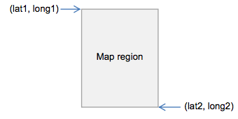
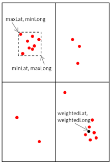

template: lucid.haml
title: Transport POIs by Map
---
---

##Transport POIs by Map
###Version Number
2.0.0

###Description
Transport POIs by Map returns a set of locations consisting of stops and/or myki ticket outlets (collectively known as points of interest &ndash; i.e. POIs) within a region demarcated on a map through a set of latitude and longitude coordinates.

>Through the __poi__ parameter, the API can return any combination of POIs (e.g. ticket outlets only, bus stops only, tram stops and ticket outlets only, all of the above, and so on).

Where POIs are geographically dispersed they are returned in a list; where they are geographically concentrated they can be returned in a cluster, depending on the map griddepth that is sent in the request.

>Have a play around with the griddepth parameter to see what best suits the device you are developing for.
If you set griddepth to zero it will not cluster.

You can also set a limit of how many stops are listed in a cluster. The API will return what the total number of POIs is, however it will only return data for as many POIs are set by the limit. Check out the example response below for a better understanding of how this works.

>When there are more POIs in a cluster than the limit, the POIs returned will be determined by a business rule that is hard coded at the server end. The order of priority is V/Line stops first, followed by train, tram, bus, NightRider and, last of all, ticket outlets.

###Request URL

base URL
<code>/v2/poi/%@/lat1/%@/long1/%@/lat2/%@/long2/%@/griddepth/%@/limit/%@?devid=%@
&signature=%@</code>

###Parameters

* `poi`        =        a comma separated list of numbers representing the types of POIs you want returned, defined as follows:

    * `0`        Train (metropolitan)
    * `1`        Tram
    * `2`        Bus (metropolitan and regional, but not V/Line) 
    * `3`        V/Line regional train and coach
    * `4`        NightRider
    * `100`        Ticket outlet

    > e.g. `0,1,2,4,100` would return train, tram, bus, NightRider & ticket outlets

* `lat1`        =        latitude at the top left corner of a region depicted on a map, expressed in decimal degrees.*
    
    >e.g. `-37.82392124423254`

* `long1`        =        longitude at the top left corner of a region depicted on a map, expressed in decimal degrees.*
    
    > e.g. `144.9462017431463`

* `lat2`        =        latitude at the bottom right corner of a region depicted on a map, expressed in decimal degrees.*
    
    > e.g. `-37.81540959390813`

* `long2`        =        longitude at the bottom right corner of a region depicted on a map, expressed in decimal degrees.*
    
    > e.g. `144.9542017407848`

The coordinate pairs (lat1, long1) and (lat2, long2) are two diagonally opposite corners of the map region of interest, namely:

* `griddepth`        =        the number of cells per block of cluster grid (between 0-20 inclusive).

    > e.g. "1" would look like this:

(image missing)

                ...while "2" would look like:

(image missing) 

* `limit`        =        the minimum number of POIs (stops or outlets) required to create a cluster, as well as the maximum number of POIs returned as part of a cluster in the JSON response (for example, if the limit is "4", at least 4 POIs are required to form a cluster; and in the JSON response, if there are 7 total locations in a cluster, only 4 will be listed in the response)

    > e.g. 4
    
* `devid`        =        the developer ID supplied in your email from PTV
* `signature`        =        the customised message digest calculated using the method in the Quick start guide

###Response
Returns a list of JSON objects which are either "locations" or "clusters"; "clusters" have their own list of "locations" within them.
"locations" have either a "stop" or "outlet" (i.e. ticket outlet) object embedded within them.
For more information on the data structures, check out the JSON object structure.

####Each stop and outlet "location" object has the following attributes:

* `suburb`        string &ndash; the suburb name &ndash; e.g. "Belgrave"
* `location_name`       string &ndash; the name of the stop based on a concise geographic description &ndash; e.g. "20-Barkly Square/115 Sydney Rd (Brunswick)" 
* `lat`        decimal number &ndash; geographic coordinate of latitude &ndash; e.g. -37.82005
* `lon`        decimal number &ndash; geographic coordinate of longitude &ndash; e.g. 144.95047
* `distance`        decimal number &ndash; returns zero in the context of this API

####"stop" objects have the following extra attributes:

* `transport_type`        string &ndash; the mode of transport serviced by the stop &ndash; e.g. can be either "train", "tram", "bus", "vline" or "nightrider"
* `stop_id`        numeric string &ndash; the unique identifier of each stop &ndash; e.g. "2171"

####While "outlet" objects have the following extra attributes:

* `outlet_type`        string (limited values) &ndash; either "stop" meaning a myki card machine at a station or stop or "retail" meaning a shop of some kind &ndash; e.g. "retail"
* `business_name`        string &ndash; the business name of the outlet &ndash; e.g. "IGA Victoria Harbour"

####For each set of locations and clusters, it will also return the following objects:

* `minLat`        

    > decimal number &ndash; the minimum latitude value of all of the locations in the cluster, including those that are not returned (i.e. they are beyond the limit set)\*\*

    > e.g. -37.81959

* `minLong`        decimal number

    > the minimum longitude value of all of the locations in the cluster, including those that are not returned (i.e. they are beyond the limit set)\*\*

    > e.g. 144.979126

* `maxLat`        decimal number

    > the maximum latitude value of all of the locations in the cluster, including those that are not returned (i.e. they are beyond the limit set)\*\*

    > e.g. -37.8134956

* `maxLong`       decimal number

    > the maximum longitude value of all of the locations in the cluster, including those that are not returned (i.e. they are beyond the limit set)\*\*

    > e.g. 144.9854

* `weightedLat`        decimal number

    >latitude at the point that is the average of all POIs returned in a grid cell\*\*

    > e.g. -37.81671

* `weightedLong`        decimal number

    > longitude at the point that is the average of all POIs returned in a grid cell\*\*

    > e.g. 144.982849

* `totalLocations`        integer

    > the total number of locations within the region described above

    > e.g. 7

\*\*        The set of coordinates above describe the following points (sample only):
  

### Example use case
Janelle wants to develop her app further and allow tourists to see public transport stops in an entire region that the tourist has selected on a map. She wants the tourists to be able to specify which mode of stops they see (i.e. train, tram, bus, V/Line or NightRider) and also to be able to see myki ticket outlets if they want. Janelle uses the Transport POIs by Map API to do this.

* Example location: Area around Brunton Avenue, Richmond, VIC 3002, Australia
* Example POIs selected: Train, Tram, Bus, Ticket Outlet
* Example request
<code>http://timetableapi.ptv.vic.gov.au/v2/poi/0,1,2,100/lat1/-37.82205143151239/long1/144.9779160007277/lat2/-37.81393456848758/long2/144.9859159992726/griddepth/3/limit/6?devid=4&signature=2BELL8A77A14452DEC110FD849906EBE4F10DC7B</code>
* Example response  

  <h4>Example Transprt POIs by Map response</h4>
<pre>
{
  "minLat": -37.81959,
  "minLong": 144.979126,
  "maxLat": -37.8157463,
  "maxLong": 144.9854,  
  "weightedLat": -37.81671,
  "weightedLong": 144.982849,  
  "totalLocations": 7,  
  "locations": [  
    {
      "suburb": "Melbourne City",  
      "transport_type": "tram",
      "stop_id": 2171,  
      "location_name": "7B-Rod Laver Arena/Melbourne Park ",
      "lat": -37.81959, 
      "lon": 144.979126,
      "distance": 0.0
    },
    {
      "suburb": "East Melbourne",
      "transport_type": "tram",
      "stop_id": 2823,
      "location_name": "Jolimont Rd/Wellington Pde #10 ",
      "lat": -37.8157463,
      "lon": 144.979782,
      "distance": 0.0
    },
    {
      "suburb": "East Melbourne",
      "transport_type": "tram",
      "stop_id": 2825,
      "location_name": "Clarendon St/Wellington Pde #11 ",
      "lat": -37.81603,
      "lon": 144.9824,
      "distance": 0.0
    },
    {
      "suburb": "East Melbourne",
      "transport_type": "train",
      "stop_id": 1104,
      "location_name": "Jolimont-MCG ",
      "lat": -37.81653,
      "lon": 144.9841,
      "distance": 0.0
    },
    {
      "outlet_type": "Stop",    
      "suburb": "East Melbourne",
      "business_name": "Jolimont Station",
      "location_name": "Wellington Cres",
      "lat": -37.81653,
      "lon": 144.9841,
      "distance": 0.0
    },
    {
      "suburb": "East Melbourne",
      "transport_type": "tram",
      "stop_id": 2824,
      "location_name": "Powlett St/Wellington Pde #12 ",
      "lat": -37.8163261,
      "lon": 144.985016,
      "distance": 0.0
    },  
    {
      "outlet_type": "Retail",
      "suburb": "East Melbourne",  
      "business_name": "7-Eleven MCG Melbourne",
      "location_name": "142 Wellington Parade",
      "lat": -37.8162231, 
      "lon": 144.9854,
      "distance": 0.0
    }
  ],    
  "clusters": []
}
</pre>

